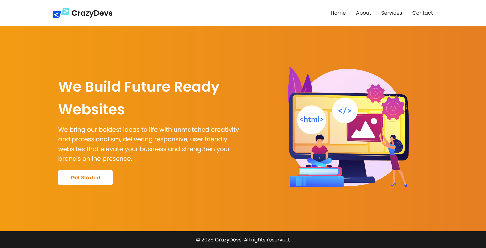
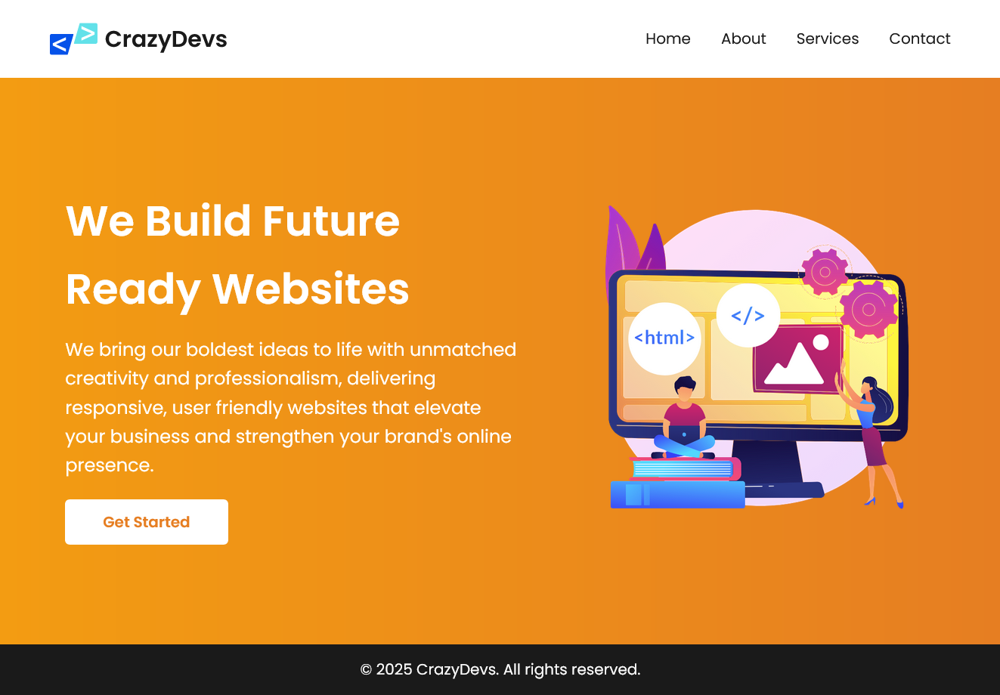
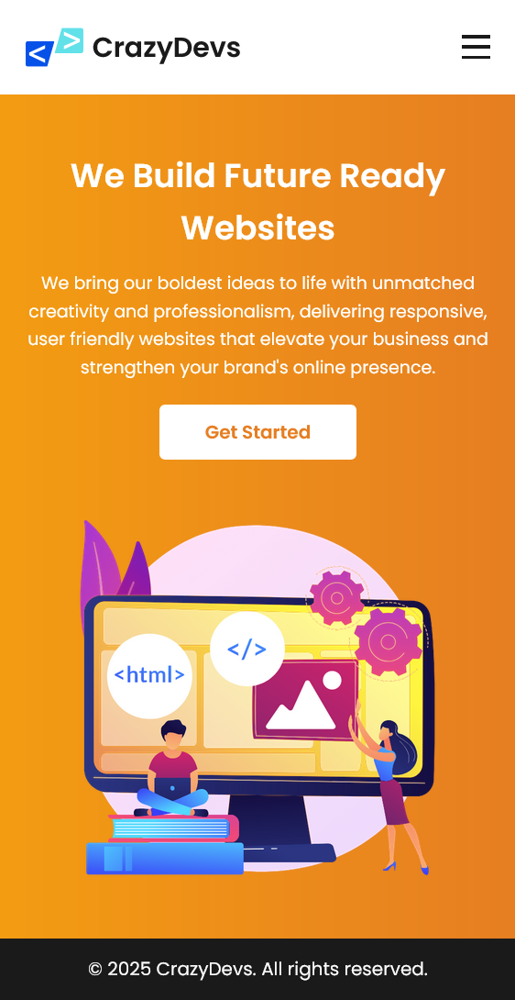

# 🚀 Responsive Landing Page - CrazyDevs

This is a **fully responsive landing page** project created for **CrazyDevs**, showcasing clean design, mobile-first responsiveness, and modern UI/UX principles. It features a bold hero section, navigation menu with hamburger support, and a call-to-action — ideal for a tech service company or agency.

## 🌐 Live Preview

🔗 [View Live Project](https://stellar-gecko-9e3fdf.netlify.app/)

## 📸 Screenshots

> Add your screenshots in the `screenshots/` folder and reference them here like below:

## 🛠️ Built With

- HTML5
- CSS3 (Flexbox + Media Queries)
- Vanilla JavaScript
- Google Fonts (`Poppins`)
- Responsive Design Principles

## 📁 Project Structure

Task 1/
├── index.html
├── style.css
├── asset/
│ ├── logo.svg
│ └── hero section.png
├── screenshots/
│ ├── desktop.png
│ ├── tablet.png
│ └── mobile.png
└── README.md

## 📱 Features

- ✅ Fully responsive for all screen sizes (mobile, tablet, desktop)
- ✅ Hamburger menu for small screens
- ✅ Smooth layout with Flexbox
- ✅ Clean, modern UI
- ✅ Gradient hero background and styled CTA
