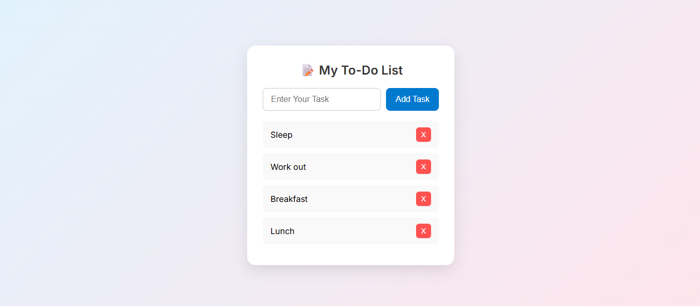
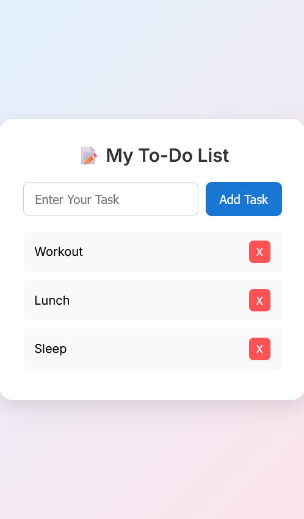

# ✅ To-Do List Web App (Vanilla JavaScript)

This is a **dynamic, responsive To-Do List** application built using **HTML, CSS, and Vanilla JavaScript**. It allows users to **add**, **mark complete**, and **delete** tasks instantly without reloading the page. Designed with a clean and modern UI to demonstrate core front-end skills and DOM manipulation.

---
## 🌐 Live Demo

🔗 [View Live Project](https://loquacious-khapse-0d71a0.netlify.app/)

---

## 📸 Screenshots

---

## 🛠️ Built With    

- **HTML5**
- **CSS3 (Flexbox, Transitions)**
- **JavaScript (ES6)** – DOM Manipulation, Events
- **Google Fonts – Inter**
- **Responsive Web Design**

---

## 📁 Project Structure

Task 2/
├── index.html
├── style.css
├── script.js
├── screenshots/
│ ├── desktop.png
│ └── mobile.png
└── README.md

## 📱 Features

- ✅ Add new tasks via input field
- ✅ Mark tasks as complete (strike-through effect)
- ✅ Remove tasks with a delete button
- ✅ Fully responsive UI
- ✅ Minimal, clean design using modern CSS
- ✅ Instant DOM updates without page reload
