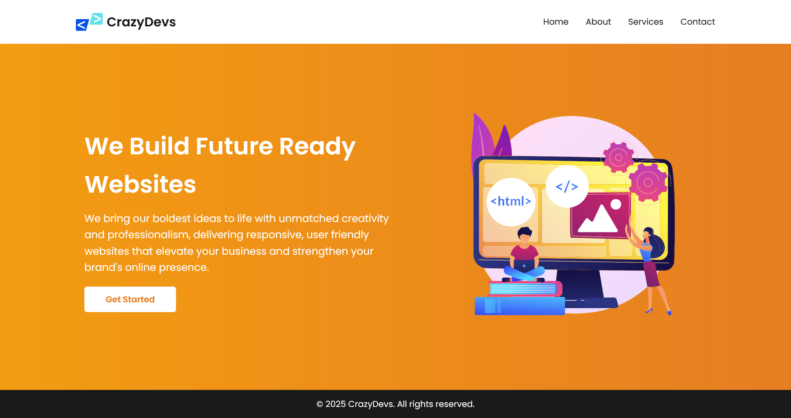
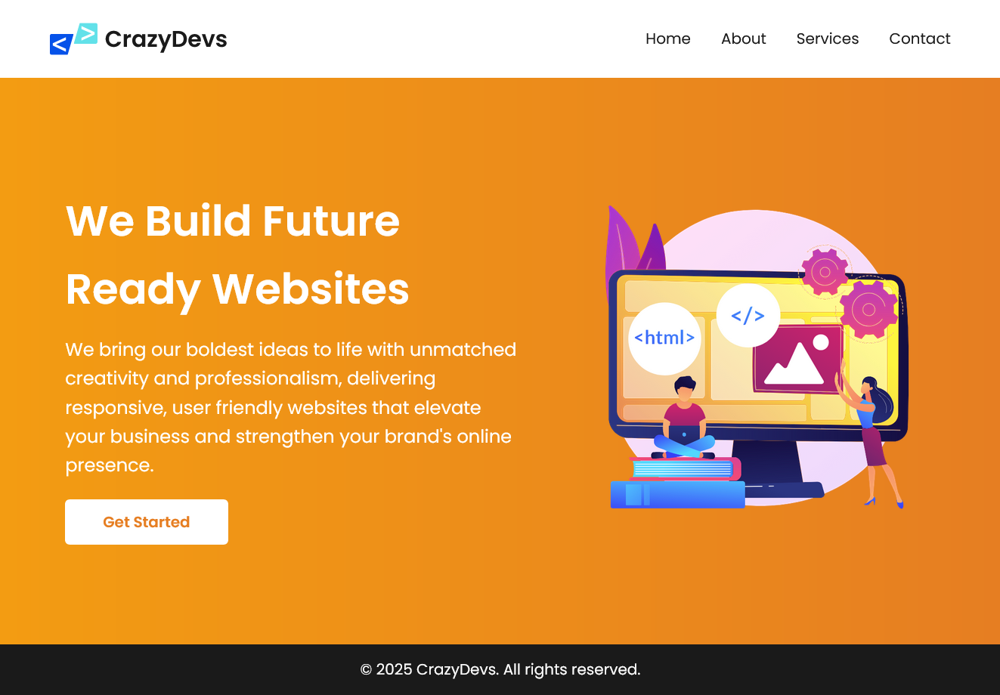
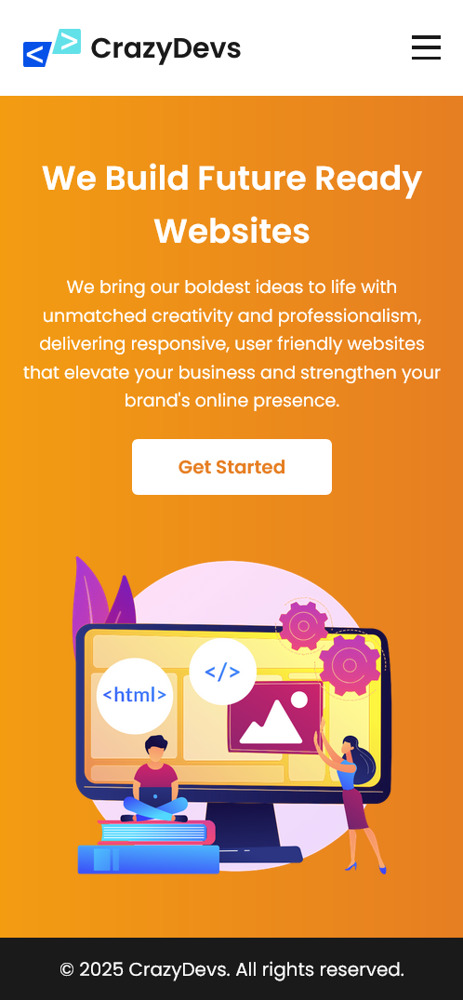

# 📱 Task 4 - Mobile-Friendly Website Using Media Queries

This project updates an existing landing page for **CrazyDevs** to be fully responsive using CSS media queries.

## 🌐 Live Link

🔗 [View Live Project](https://resilient-dolphin-2b7783.netlify.app/)

## ✅ Features

- Fully responsive layout for mobile, tablet, and desktop
- Responsive navigation with hamburger menu toggle
- Fluid image scaling and flexible layout using `flex-wrap`
- Mobile-first breakpoints with `@media` rules

## 📁 File Structure
task-4-responsive/
├── index.html
├── style.css
└── asset/
├── logo.svg
└── hero section.png

# 🛠️ Technologies Used

- HTML5
- CSS3 (Flexbox, Media Queries)
- Google Fonts (Poppins)

# 📸 Screenshots





# 🚀 How to Use
Open index.html in your browser.

Resize window or open DevTools to test responsiveness.

## 👨‍💻 Author
Designed and coded by CrazyDevs

## 📏 Media Queries Used

```css
@media (max-width: 1024px) { ... }
@media (max-width: 768px) { ... }
@media (max-width: 480px) { ... }
