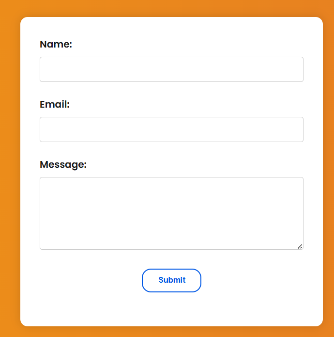
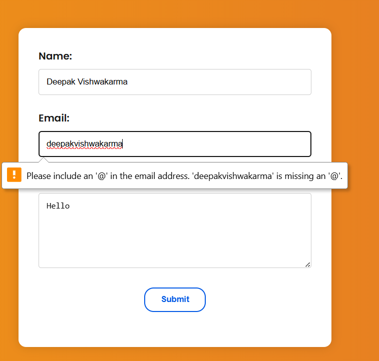
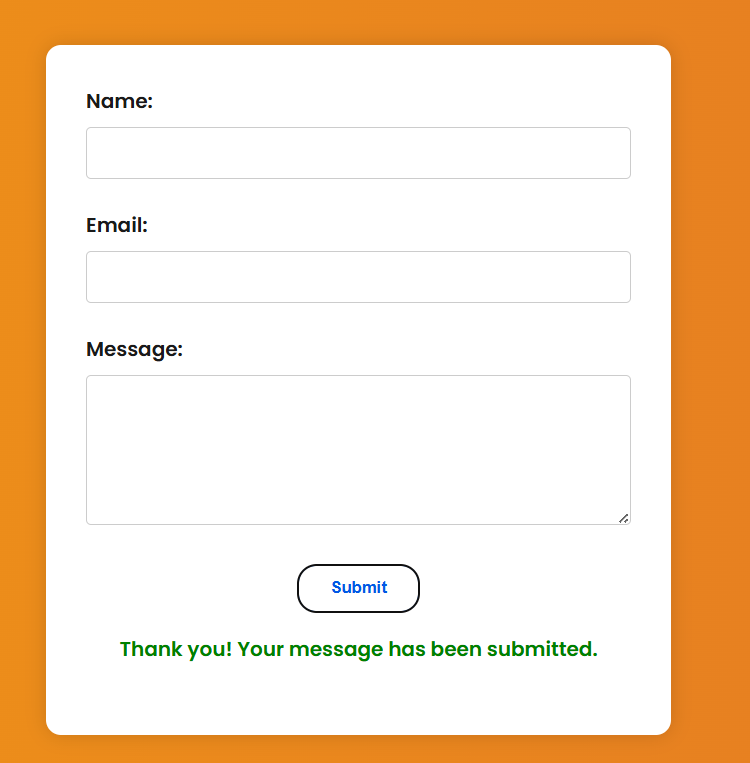

# Task 6: Contact Form with JavaScript Validation – CrazyDevs Landing Page

🚀 **Live Project:** [https://cheerful-sunburst-b2f753.netlify.app/](https://cheerful-sunburst-b2f753.netlify.app/)

## 📌 Task Objective

Create a responsive contact form that includes client-side validation using JavaScript. The form should handle:
- Required input validation
- Email format validation using Regex
- User feedback (error and success messages)

## 🛠️ Tools Used
- **Code Editor:** VS Code  
- **Browser:** Google Chrome  
- **Languages/Tech:** HTML5, CSS3, JavaScript (Vanilla)

---

## 📄 Project Overview

This landing page for **CrazyDevs** includes a modern, mobile-responsive layout and a fully functional contact form. The contact form validates user input using JavaScript and shows real-time feedback messages for errors and successful submission.

### ✅ Features Implemented
- Responsive layout using Flexbox and media queries
- Styled contact form with clear visual hierarchy
- Client-side form validation:
  - Name and message must not be empty
  - Email validated using a regular expression
- Displays inline error messages for each field
- Displays a green success message if all inputs are valid
- Prevents form submission if inputs are invalid

---

## 📸 Screenshots:





## 🧪 Validation Logic

JavaScript is used to:
- Attach a `submit` event listener to the form
- Check for empty inputs (`name`, `email`, `message`)
- Use regex to validate the email format
- Show appropriate error or success messages without refreshing the page

### Regex Used for Email:
```javascript
/^[^\s@]+@[^\s@]+\.[^\s@]+$/

