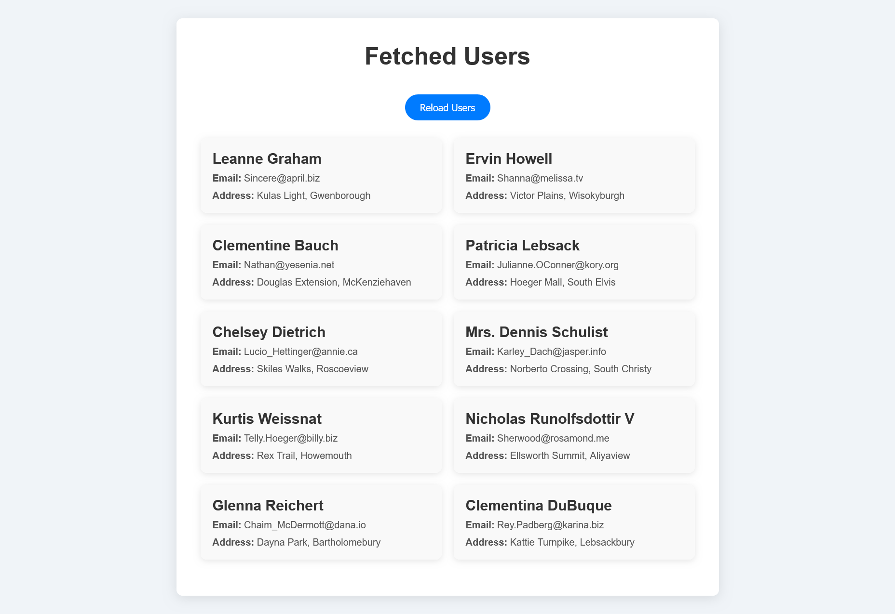

# Task 7 - Fetch Users from Public API

This project demonstrates how to fetch and display user data from a public API using JavaScript's `fetch` API.

## 🔧 Tools Used

- HTML, CSS, JavaScript
- [JSONPlaceholder](https://jsonplaceholder.typicode.com/users) API
- VS Code
- Chrome Browser

## 📌 Features

- Fetches user data from a public API
- Displays name, email, and address in styled user cards
- Handles network errors
- Reload button to refetch data
- Responsive layout for mobile devices

## 🚀 How to Run

1. Clone or download the repository.
2. Open `index.html` in your browser.
3. Click **Reload Users** to fetch data again.
4. Disconnect internet to test error handling.

## 📷 Screenshot

## 🌐 Live Demo

[Live Project](https://superb-naiad-d709f5.netlify.app/)

---

## 📁 File Structure

/task 7
│
├── index.html
├── style.css
├── script.js
└── screenshot.png

---

## 📘 Concepts Learned

- Asynchronous JavaScript with `fetch`
- JSON parsing
- DOM manipulation
- Error handling with `.catch()`
- Responsive grid with CSS Grid