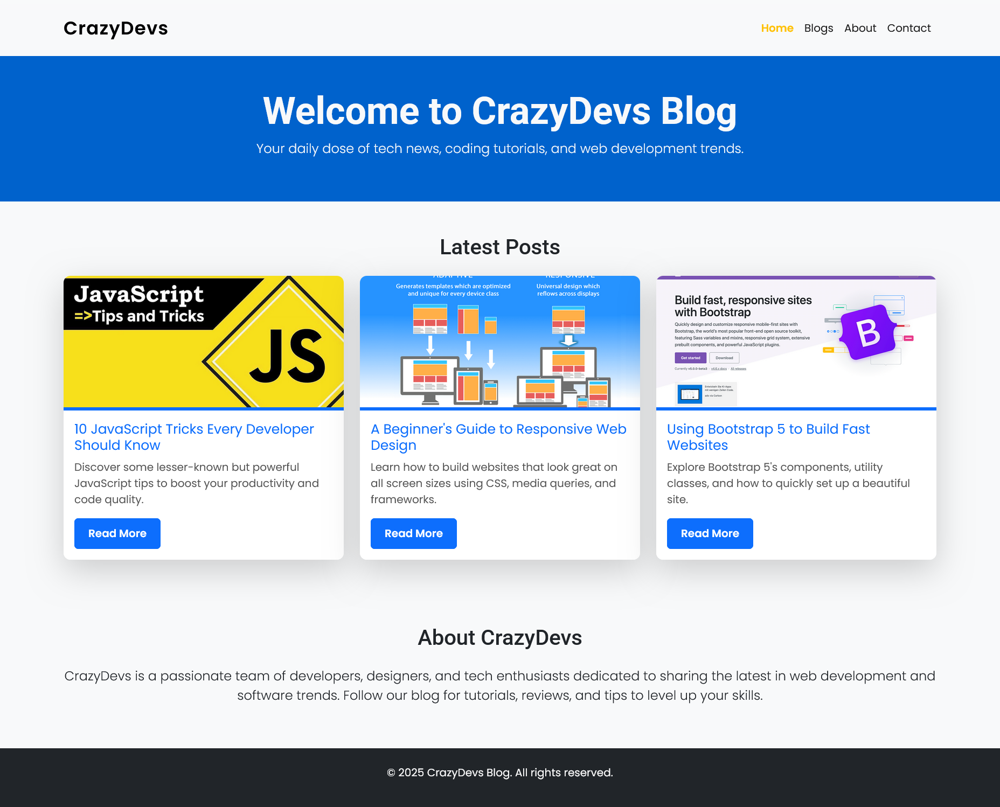
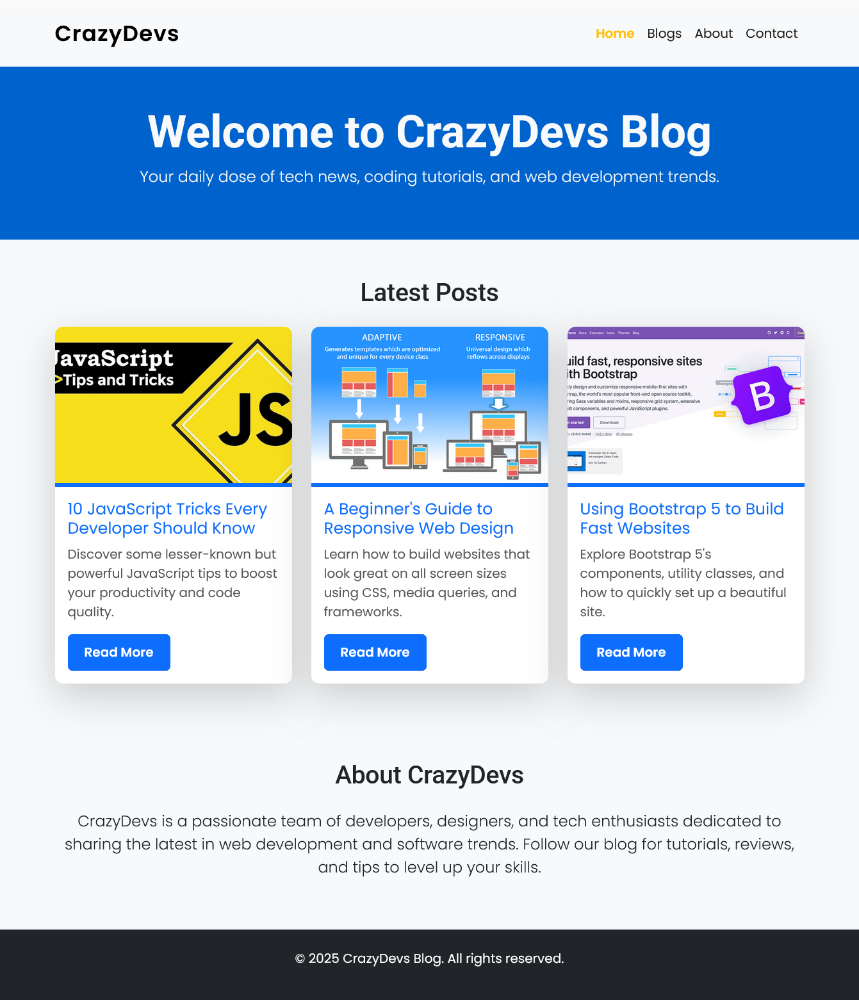
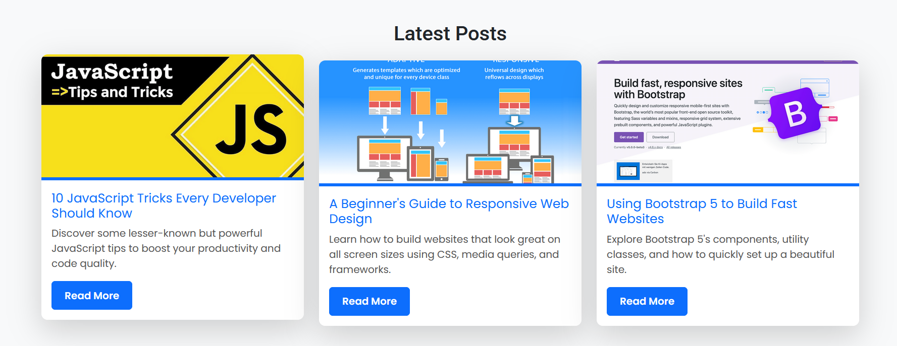

# 📰 CrazyDevs Blog - Task 8

A modern, responsive **blog website** built using **Bootstrap 5** and **custom CSS enhancements**. This layout includes a navbar, featured blog cards with images and hover effects, an about section, and a footer — all styled with attention to detail.

---

## 🔗 Live Preview

[🚀 View Live Site](https://phenomenal-gingersnap-3516bf.netlify.app/)

---

## 📌 Task Objective

> **Task 8: Create a Simple Blog Layout Using Bootstrap 5**  
Design a clean, professional blog homepage using Bootstrap’s grid system and components. Incorporate custom styles and responsive behavior for all devices.

---

## 🛠️ Tech Stack

- ✅ **HTML5**  
- ✅ **CSS3 (with custom styling)**  
- ✅ **Bootstrap 5 (CDN)**  
- ✅ **Responsive Images & Typography**  
- ✅ **Google Fonts (Roboto + Poppins)**

---

## 📄 Project Structure
Task 8/
├── index.html 
├── style.css 
└── asset/
├── javascript.webp
├── responsive.png
└── bootstrap.png

---

## 💡 Features

- ✔️ **Responsive Navigation Bar** with active link styling
- ✔️ **Hero Section** with bold header and subtext
- ✔️ **Three Blog Cards** with real image assets and hover effects
- ✔️ **Custom Gradient Navbar & Button Hover Effects**
- ✔️ **About Section** for company/brand story
- ✔️ **Sticky Footer** with copyright
- ✔️ **Typography with Google Fonts**
- ✔️ **Responsive Layout for Mobile and Desktop**

---

## 🎨 Design Highlights

| Element        | Design Note                                   |
|----------------|-----------------------------------------------|
| **Navbar**     | Gradient background, hover highlights         |
| **Blog Cards** | Elevation hover, sharp image, rounded corners |
| **Buttons**    | Custom padding, hover scale animation         |
| **Fonts**      | Poppins (Body), Roboto (Headings)             |

---

## 📷 Screenshots

---

## 🚀 How to Run Locally

1. Clone or download the repository.
2. Open `index.html` in any modern web browser (Chrome recommended).
3. No setup or server needed. Everything runs client-side.

---

## 📚 Learning Outcomes

- ✅ Bootstrap layout and grid
- ✅ Card components with images and text
- ✅ Responsive design using breakpoints
- ✅ Custom CSS integration with Bootstrap
- ✅ Typography and visual hierarchy
- ✅ Page sectioning and navigation